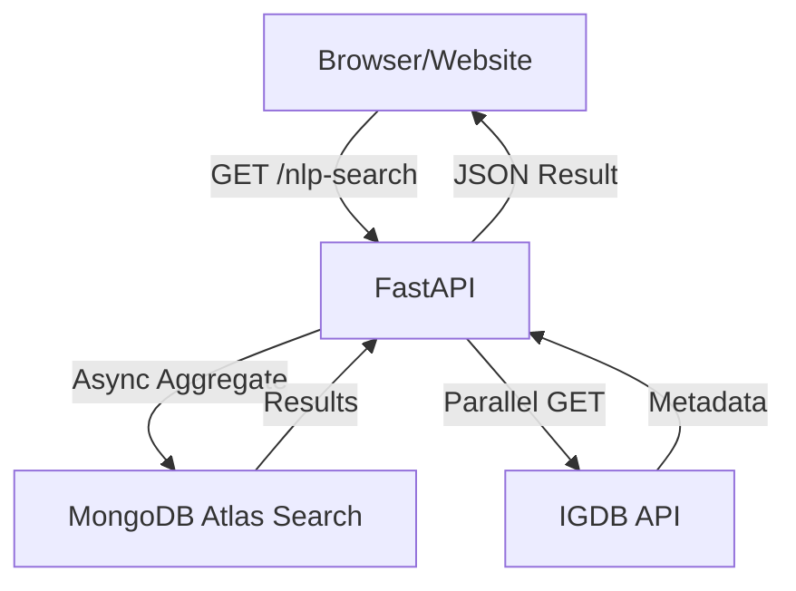

# Technical Documentation - Game Search API

This document provides a deep dive into the architecture, endpoint logic, and performance optimizations of the High-Concurrency Game Search API.

## 1. System Architecture
The system follows a non-blocking, asynchronous pattern to maximize throughput for high-traffic environments.



### Key Components
- **FastAPI**: Asynchronous web framework.
- **Motor**: The async driver for MongoDB.
- **Httpx**: Modern async HTTP client for IGDB requests.
- **Cachetools**: In-memory `TTLCache` for metadata persistence.

---

## 2. API Endpoint Reference

### `GET /nlp-search`
Performs a semantic and text-based search.

| Parameter | Type | Required | Description |
|---|---|---|---|
| `q` | string | Yes | The query string (supports acronyms like 'gta') |

**Response Format:**
```json
[
  {
    "_id": "string",
    "gameName": "string",
    "cover_url": "url",
    "rating": float,
    "search_score": float
  }
]
```

#### Search Strategy (Atlas Search)
The API uses a **Compound Search** strategy with four layers:
1. **Phrase Match** (Boost: 15): Handles exact titles perfectly.
2. **Wildcard Match** (Boost: 10): Prioritizes titles starting with the query (e.g., "spi" -> "Spider-Man").
3. **Text Match** (Boost: 5): Standard keyword matching.
4. **Fuzzy Match** (Boost: 2): Handles minor typos and spelling errors.

---

## 3. Acronym Expansion
To improve UX, the system automatically expands common acronyms before querying the database.

**Examples:**
- `mw2` -> `Modern Warfare II`
- `spiderman` -> `Marvel’s Spider-Man`
- `bmw` -> `Black Myth: Wukong`

See `COMMON_ACRONYMS` in `search_service2.py` for the full list of 50+ definitions.

---

## 4. Performance Optimizations
The service is optimized to deliver results in less than 1 second, even for "cold" searches.

1. **Parallel Enrichment**: Using `asyncio.gather`, the API fetches metadata for all 6-8 results simultaneously rather than sequentially.
2. **Persistent Connection Pool**: The `IGDBService` maintains a long-lived `httpx.AsyncClient` session, eliminating the overhead of repeated SSL handshakes.
3. **Token Locking**: An `asyncio.Lock` ensures that multiple simultaneous requests don't all trigger a Twitch token refresh at the same time.
4. **TTLCache**: Metadata is cached in memory for **24 hours**, making subsequent searches for the same game near-instant (<50ms).

---

## 5. Deployment for Friends
When exposing this API to other developers:
- Ensure `allow_origins=["*"]` is set in CORS (default).
- Provide the `.env.sample` file for their own configuration.
- Recommend using a production ASGI server like `uvicorn` with multiple workers.
